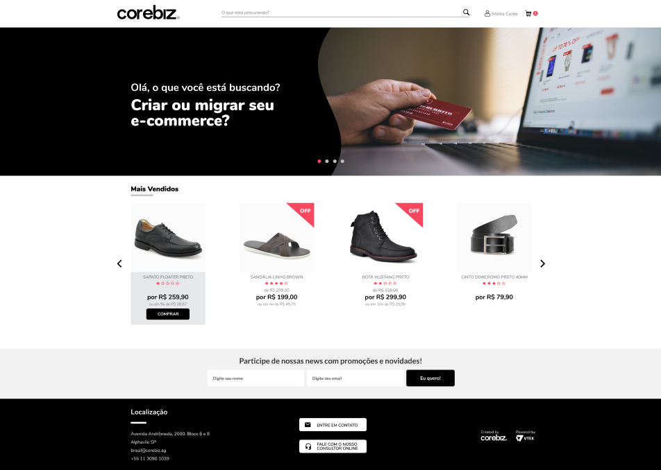

<h1 align="center">
Teste para a vaga de Desenvolvedor Front-End
</h1>

 Teste feito para a vaga de desenvolvedor Front-end 

   

  

  <a href="https://phschaves.github.io/" target="blank">Link para visualização</a>

## Tecnologias Utilizadas

- [X] JQuery
- [X] HTML
- [X] Css

Para execução desse projeto de maneira simples, basta utilizar a extensão "Live Server" em seu editor de texto e ao clicar com o botão direito do mouse sobre o arquivo "index.html" selecionar a opção "Open with Live Server"

